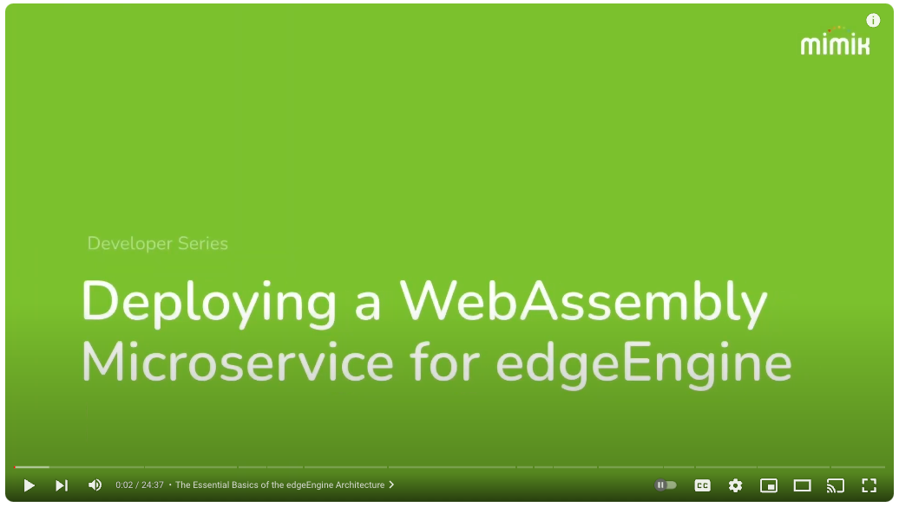
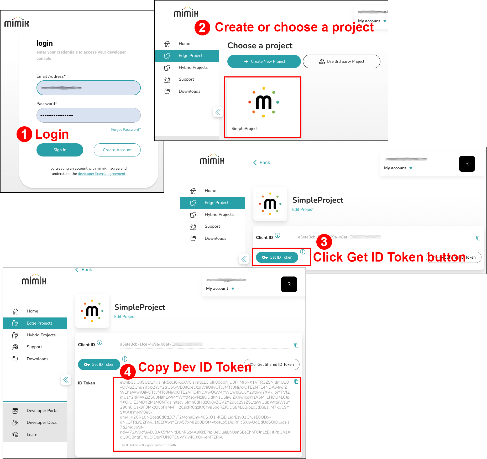

# Building mimimk microservice using WASM

The purpose of this project is to demonstrate how to build a mimik microservice using a [WebAssembly (WASM)](https://developer.mozilla.org/en-US/docs/WebAssembly) module. The WASM module is compiled from a C++ program that uses the WASI SDK. The WASM module is then deployed as a mimik microservice the runs under the edgeEngine runtime.

There are two ways to use this project. The first way to start from scratch by configuring your development machine to include the tools and applications required to build, deploy and execute the WASM microservice under the mimik edgeEngine runtime.

The second way is to use Visual Studio Code's Dev-in-Container feature to build, deploy and execute the WASM microservice using nothing more than the scripts to are part of this repository.

# Running the project from scratch
Running the project from scratch requires that you have the following tools and applications installed on your development machine. Then, once the tools and applications are installed, you can use the instructions in the hands-on tutorial to build, deploy and execute the WASM microservice.

## Prerequisites

- A mimik developer account. You can create one [here](https://developer.mimik.com/).
- A computer running:
  - [NodeJs and npm](https://nodejs.org/en/learn/getting-started/how-to-install-nodejs).
  - Python 2.7 or higher and pip.
  - `cmake`
  
## Step-by-Step Instructions
The instructions for building and running the WASM microservice from scratch are described in a hands-on tutorial that is available [here](https://devdocs.mimik.com/tutorials/11-index).

Also, the following is a video version of the WASM microservice tutorial. Click on the image to view the video.

[](https://youtu.be/FIhXELRXuds)


# Running the project using VS Code's Dev-in-Container feature 

The following instructions describe how to use Visual Studio Code's Dev-in-Container feature to build, deploy and execute the WASM microservice using nothing more than the scripts to are part of this repository. The  benefit of using this approach is that you don't need to install any tools or applications on your development machine. Everything you need to build, deploy and execute the WASM microservice is included in the repository.

**Step 1:** Add the Dev-in-Container extension to VS Code

Follow this instruction to set up the Dev-in-Container extension under VS Code: https://code.visualstudio.com/docs/devcontainers/tutorial

|**Important Note:**|
|---|
|Run the following instructions in Steps 2 - 11 from within terminal windows in the VS Code IDE. Running instructions in a terminal in VS Code will run the given instruction in the project's development container.|


**Step 2:** In a terminal window within VS Code, clone this repository


```bash
git clone  https://github.com/edgeMicroservice/wasm-example-cpp-microservice.git
```

---

**Step 3:** In a terminal window within VS Code, navigate to repository's working directory on your local machine
```bash
cd wasm-example-cpp-microservice
```

---

**Step 4:** Run the following command in a terminal windows within VS Code to build the WASM microservice.

```bash
./build.sh
```

---

**Step 5:** In a terminal window within VS Code, make a copy of `local/start-wasm-example.json` as `start.json`
```bash
cp ./local/start-wasm-example.json ./local/start.json
```

---

**Step 6:** Run the following command in a terminal window in VS Code to start the edgeEngine runtime.
```bash
./start-edge.sh
```

---

**Step 7:** Create a Developer ID Token from within the mimik Developer Portal as shown in the figure below. Then from within a new terminal window in VS Code, assign the Developer ID Token to an environment variable named `$DEV_ID_TOKEN`.



In a terminal window in VS Code, run the following command to assign the Developer ID Token to an environment variable named `$DEV_ID_TOKEN`.

```bash
DEV_ID_TOKEN=<YOUR-DEVELOPER-TOKEN-CREATED-FROM-MIMIK-DEVELOPER-CONSOLE>
```

---

**Step 8:** Copy the value of `$DEV_ID_TOKEN` to a file named `.devidtoken` in the root of the repository.

```bash
echo $DEV_ID_TOKEN > .devidtoken
```

---

**Step 9:** Run the following command to deploy the WASM microservice to edgeEngine.

```bash
./setup-edge.sh
```


You'll see output similar to the following:
```bash
{"result":{"accountId":"d4011bb5-81dd-4011-9471-d76b56e00xxx__2972174601916518xxx"},"status":"successfully associated"}
```

---

**Step 10:**  In the terminal window run the following command to hot start and deploy the WASM based microservice within the VS Code development container.
```bash
./hot-deploy.sh
```

Eventually you will get output similar to the following:
```bash
{
  "clientId": "a5efe3cb-1fce-469a-b8af-38279c87axxx",
  "created": 1706636106055,
  "env": {
    "MCM.BASE_API_PATH": "/a5efe3cb-1fce-469a-b8af-38279c87a759/wasm-example/v1",
    "MCM.DB_ENCRYPTION_SUPPORT": "false",
    "MCM.LINKLOCAL_REPLAY_NONCE_SUPPORT": "false",
    "MCM.RUNTIME": "wasm",
    "MCM.WEBSOCKET_SUPPORT": "false"
  },
  "id": "a5efe3cb-1fce-469a-b8af-38279c87a759-wasm-example-v1",
  "image": "wasm-example-v1",
  "imageId": "a5efe3cb-1fce-469a-b8af-38279c87a759-wasm-example-v1",
  "name": "wasm-example-v1",
  "state": "started",
  "status": "up"
}
[nodemon] clean exit - waiting for changes before restart
```

The WASM based microservice is now running within the edgeEngine runtime.

Notice the value of `MCM.BASE_API_PATH`. This is the base path for the microservice running within the development container. You will use this value to access the microservice.

Using the data in the output above, the base path for the microservice is `localhost:8083/a5efe3cb-1fce-469a-b8af-38279c87a759/wasm-example/v1`. However, the microservice that reports the current time runs at the `/time` endpoint. Thus, the full URL to access the microservice is:

```bash
http://localhost:8083/a5efe3cb-1fce-469a-b8af-38279c87a759/wasm-example/v1/time
```

Your base path will be different from the one above. Use the value of `MCM.BASE_API_PATH` from the output of the `hot-deploy.sh` command to access the microservice.

---

**Step 11:** To test the endpoint, in yet another, new terminal window, execute the following `curl` command to execute the WASM microservice.

```bash
curl localhost:8083/a5efe3cb-1fce-469a-b8af-38279c87a759/wasm-example/v1/time 
```

You'll get output similar to the following:

```bash
{"current_time":"Tue Jan 30 17:37:12 2024\n"}
```

**REMEMBER:** When running the `curl` command, replace the value of `MCM.BASE_API_PATH` with the value that is particular from the output when you run the `hot-deploy.sh` command.
